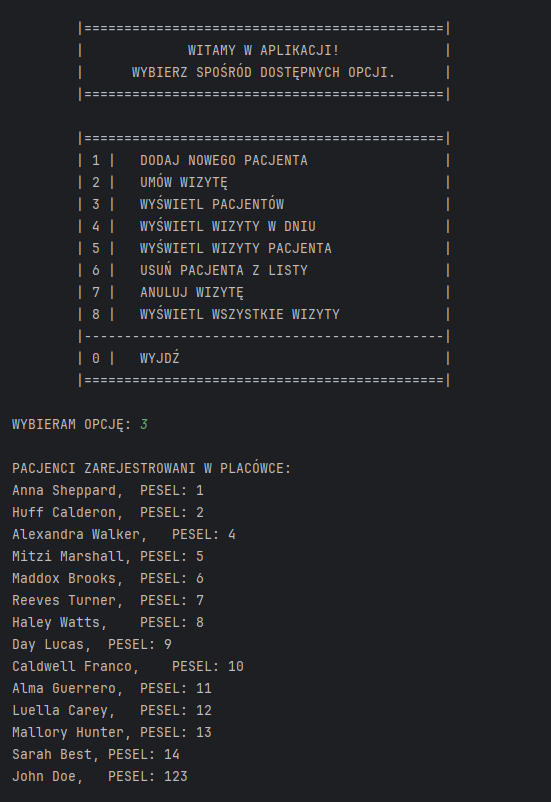
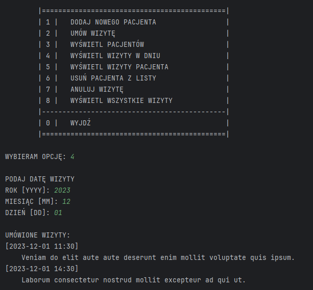
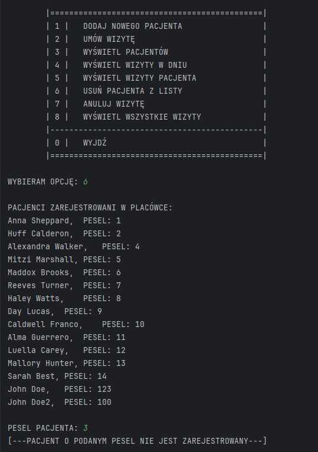

# Doctor Diary app

## General
Simple console app that simulate doctor e-diary for storing patients and appointments data. The app allows to e.g. enter patient data to the system, assign an appointment to a patient, read list of all appointments for the specified patient or date. Data persistence is based on text files with json format - patients.json' and 'appointments.json'.

## Demo

## Installation
Entrypoint for the app is 'main.py' file and after running the app, you will see simple interface in your CLI.
This app does not require extra packages except Python standard library.

